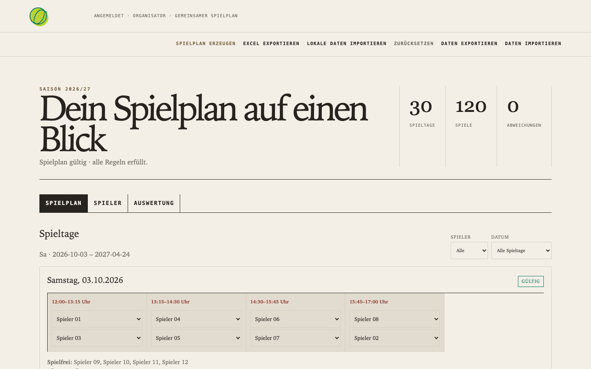

# Tennisrunde

Hallo und willkommen bei der Tennisrunde von Fountain Coach.

Dieser Release ist eine klare, gemeinsame Spielplan-App für eine regelmäßige Tennisrunde: Regeln hinterlegen,
einen fairen Plan erzeugen, Änderungen prüfen und den fertigen Plan als Excel-Datei exportieren.



## Aktueller Release

Die öffentliche Anwendung läuft unter [tennis.fountain.coach](https://tennis.fountain.coach/). Der aktuelle Release
bildet die Regeln aus `Spieltagsprompt-ExtendedBE.odt` ab:

- zwölf bearbeitbare Spielerinnen und Spieler;
- alle Samstage vom 03.10.2026 bis 24.04.2027;
- vier Spiele pro Spieltag: 12:00, 13:15, 14:30 und 15:45 Uhr;
- 75 Minuten pro Spiel, acht eingesetzte und vier spielfreie Spieler;
- feste Spielzeiten, Abwesenheiten, Fairnessberechnung und Validierung;
- Filter nach Spieler und Datum sowie manuelle, erneut validierte Änderungen;
- deutscher Excel-Export;
- server-authoritative Speicherung mit SQLite und geschütztem Organizer-Zugang;
- portable JSON-Datenübernahme aus der früheren Desktop-Version.

Die Abbildung oben verwendet ausschließlich anonymisierte Bezeichnungen (`Spieler 01` usw.). Private Namen,
Abwesenheiten und Laufzeitdaten gehören nicht in dieses öffentliche Repository.

## Verwendung

1. [Tennisrunde öffnen](https://tennis.fountain.coach/) und als Organizer anmelden.
2. Im Spielplan **Daten importieren** wählen, wenn ein privater JSON-Export aus der Desktop-Version vorliegt.
3. **Spielplan erzeugen** wählen und die Validierung prüfen.
4. Spieler, Abwesenheiten und feste Zeiten im Bereich **Spieler** bearbeiten.
5. Den fertigen Plan bei Bedarf über **Excel exportieren** ausgeben.

Die Importdatei wird geprüft und nur nach ausdrücklicher Bestätigung in den gemeinsamen Spielplan übernommen.

## Optional: persönliche Spielerzugänge

Der aktuelle Release funktioniert vollständig als gemeinsamer Organizer-Spielplan. Individuelle Spielerzugänge sind
optional und keine Voraussetzung für die Nutzung.

Wenn sie später benötigt werden, kann ein verifiziertes OAuth-Konto einem vorhandenen Spieler zugeordnet werden.
Dann sieht diese Person nur den eigenen Spielplan und die für das Verständnis einer Begegnung nötigen gegnerischen
Namen. Spielerzugänge sind read-only; Spielplanänderungen bleiben beim Organizer. Die Zuordnung wird ausschließlich
in der geschützten Produktionsumgebung gepflegt und nicht in Git eingecheckt.

## Bewusste Produktgrenze

Der Release ist kein ChatGPT- oder MCP-Produkt und benötigt keine ChatGPT-Mitgliedschaft. Eine externe KI-Anbindung
ist nicht Teil des aktuellen Kundenversprechens. Der Nutzen liegt zunächst im verlässlichen gemeinsamen Spielplan.

## Entwicklung

```sh
npm ci --prefix app
npm test --prefix app
npm run test:e2e --prefix app
```

Die Anwendung verwendet Node/ESM. Für lokale Entwicklung gelten `.env`-Werte; Produktionsgeheimnisse liegen in den
geschützten GitHub-Environment-Secrets. Details stehen in [docs/deployment.md](docs/deployment.md).

Weitere technische Grenzen und Datenschutzanforderungen stehen in [app/SECURITY.md](app/SECURITY.md) und
[PRIVACY.md](PRIVACY.md). Der Kundenname „Vinegarium“ erklärt die Benennung der dedizierten Hosting-Umgebung;
die veröffentlichte Domain bleibt `tennis.fountain.coach`.
